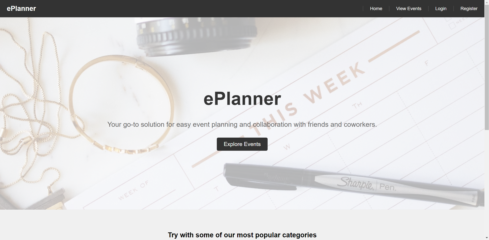
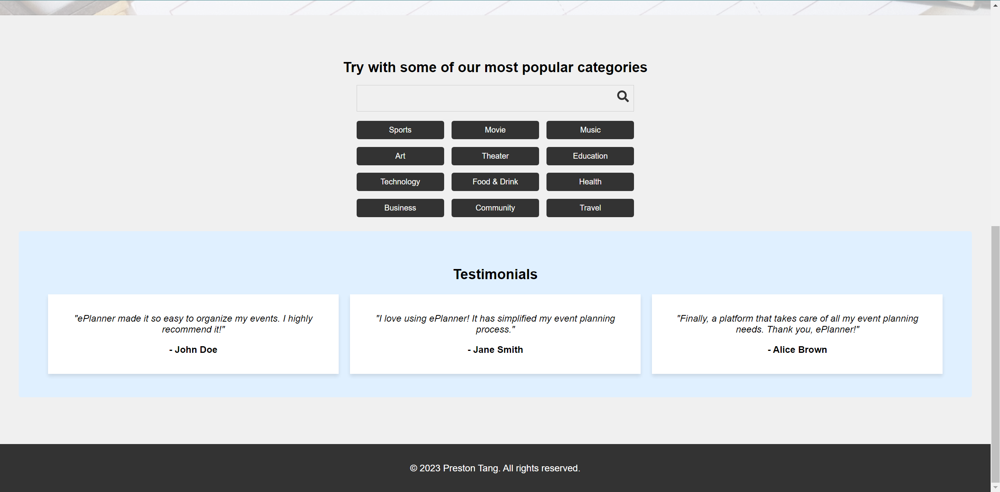
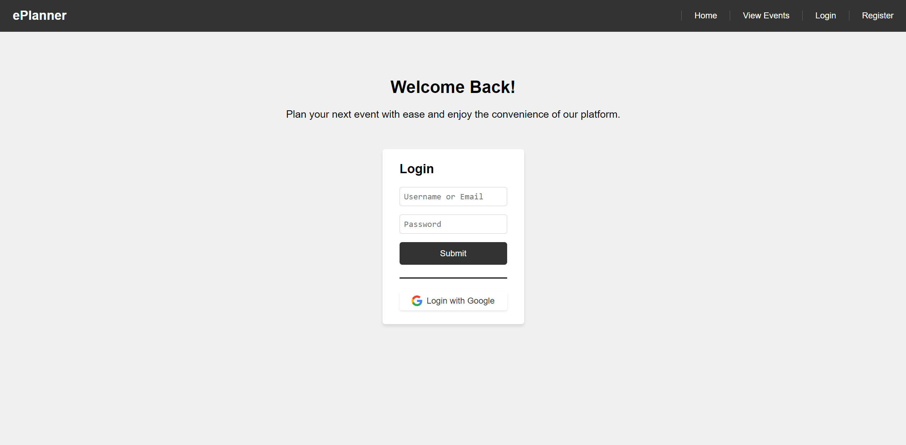
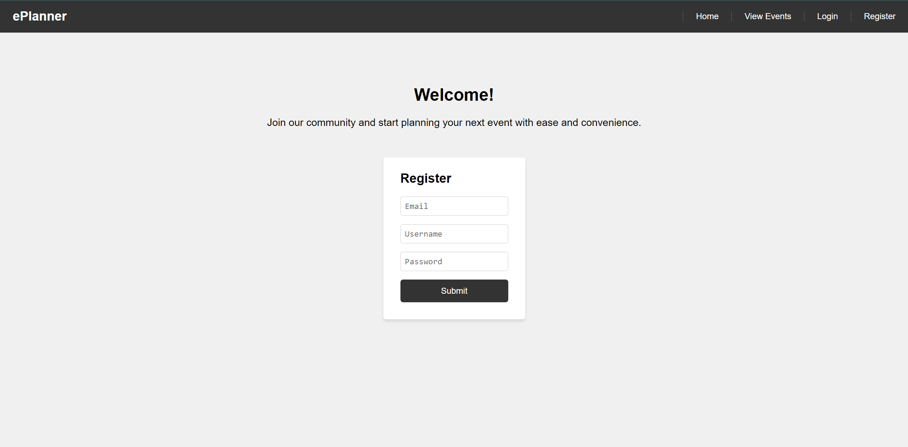
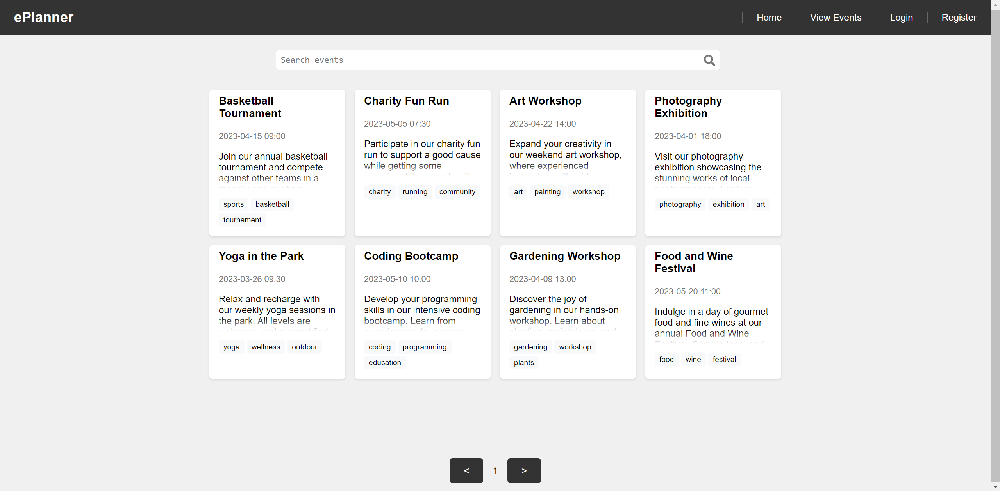
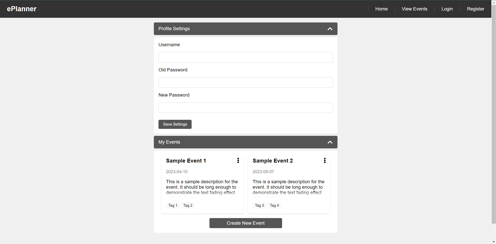
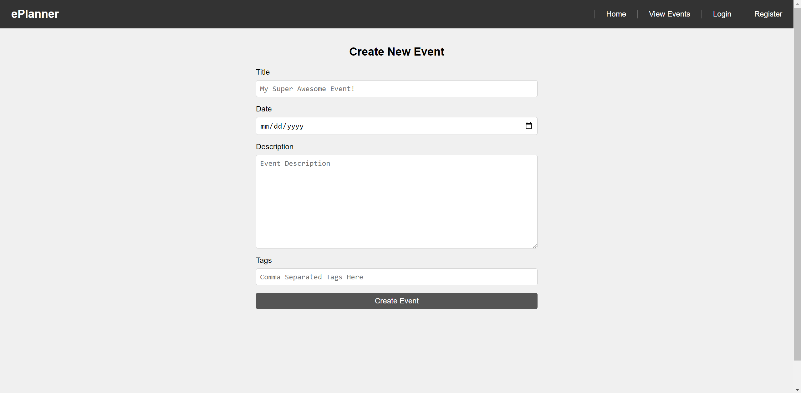

# ePlanner

To use this project, replace the mongodb secret with your own in the `.env` file

## Overview

ePlanner is an intuitive, streamlined, and efficient application designed to help you and your friends or coworkers effortlessly plan events or meetings. Users can easily create events and invite others, even those without an account, fostering seamless collaboration. Each event includes a detailed description, a specified time and location, and the option to embed supplementary materials such as Word documents, PDFs, and various media like images and videos.

Events can be customized with tags and set to either public or private visibility. A dedicated page allows users and the general public to discover nearby public events, enhancing engagement and fostering community involvement.

## Data Model

In ePlanner, the application will primarily store Users and Events.

Users: This collection will store user information, such as username, email, password, and other profile details. Users can have multiple Events associated with them (via references).

Events: This collection will contain event details, such as title, description, time, location, visibility (public or private), tags, and links to supplementary materials (e.g., Word documents, PDFs, images, and videos). Each Event will be associated with the creator (via a reference to the User) and will store a list of invited users (via references to Users).

An Example User:

```javascript
{
  _id: ObjectId,
  username: "eventorganizer123",
  email: "organizer@example.com",
  passwordHash: // a password hash,
  events: // an array of references to Event documents
}
```

An Example Event with Embedded Supplementary Files:

```javascript
{
  _id: ObjectId,
  creator: // a reference to a User object
  title: "Team Building Activity",
  description: "A fun and engaging team building activity for all team members.",
  location: "Park Plaza",
  time: // ISODate("2023-04-12T14:30:00Z"),
  visibility: "public",
  tags: ["corporate", "team-building"],
  invitedUsers: // an array of references to User objects,
  embeddedFiles: [
    {
      url: "https://example.com/presentation.pdf",
      fileType: "pdf",
      description: "Team Building Activity Presentation"
    },
    {
      url: "https://example.com/image.jpg",
      fileType: "image",
      description: "Team Building Activity Photo"
    }
  ],
  createdAt: // ISODate("2023-03-16T10:00:00Z")
}
```

## [Link to Commented First Draft Schema](db.mjs) 

## Wireframes

(__TODO__: wireframes for all of the pages on your site; they can be as simple as photos of drawings or you can use a tool like Balsamiq, Omnigraffle, etc.)

/ - the default page (home page)




/login - login page



/register - register page



/view-events - page that shows all public events



/user-page - the logged in user's page



/edit-event - the editing event page



## Site map

all pages <---> view-event, login, register
login, register <---> user-page
user-page <---> edit-event

## User Stories or Use Cases

1. as non-registered user, I can view all public events on the site
1. as non-registered user, I can register an account
2. as a user, I can log in to the site
3. as a user, I can edit my profile information
4. as a user, I can view all events I've created
5. as a user, edit my events or create new events
6. As a user, I can delete my events.
7. As a user, I can add tags to my events for better organization.
8. As a user, I can search for events based on keywords, date, or tags.

## Research Topics

* (6 points) react.js (and all other reactc stuff I used, such as react-router-dom, react-hooks)
    * my entire frontend is written in react, it's challenging so I've assigned it 5 points
    * I choose react since it's a widely used frontend framework in the industry.
    * Learning this would be very useful for me in the future if I ever wanted to do web dev
    * Also makes the frontend process a bit easier to be pretty and responsive
* (3 points) Fetch API
    * for communication between the frontend and the backend server
* (3 points) Integrate user authentication
    * I'm going to be using passport.js for user authentication, as well as for authentication with Google
    * passport.js is pretty widely used and would help in the future.
    * In the event the Google authentication proves to be too hard / tricky, I'll just stick with using this form user auth.
* (2 point) Form Validation
    * I'm going to use Yup.js for form validations throughout my project
    * Examples of this would be for login and register, making sure the data is valid.
    * I believe that Yup.js is also very widely used for form validations

14 points total out of 8 required points

## [Link to Initial Main Project File](app.mjs) 

## Annotations / References Used

(__TODO__: list any tutorials/references/etc. that you've based your code off of)

2. [tutorial on react.js](https://react.dev/learn)
1. [passport.js authentication docs](http://passportjs.org/docs)
3. [tutorial on Google sign-in](https://stackoverflow.com/questions/46654248/how-to-display-google-sign-in-button-using-html)
4. [fetch api guide](https://developer.mozilla.org/en-US/docs/Web/API/Fetch_API/Using_Fetch)
